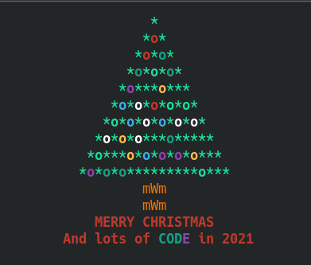

# **Norwich Python Group Christmas Code Challenge**



## Two ideas for a Christmas theme code challenge

### **Make a Christmas Decoration with Python**

Like the tree above ^^^ You can use anything to display your decoration. For example Curses,Pygame,tkinter or even LEDs controlled by a Raspberry Pi or Adafruit board.

### **Write a Cracker Bad Joke maker**

Write code that automatically makes terrible cracker jokes for your christmas dinner.

I've provided an example in the folder `joke`

Running `python joke.py` will produce a random joke

```
$ python joke.py
Why did the dinosoar cross the road? because chickens weren't invented yet
```

You can edit the `jokes.txt` file to create your own combinations, or improve the code to make smarter and better jokes.

`jokes.txt`

```
# This is a grammar file. In this top section you can put different jokes, one per line.
# When the tweet is generated, a line will be chosen at random. Empty lines, and lines
# that start with a hash, are ignored. Within a line you can put a "node" in {curly
# braces}.

Why did the {animal} cross the road? {road_punchline}
How many {lang} devs does it take to change a light bulb? {bulb_punchline}

# Sections in [square brackets] are "nodes". The same rules apply - you can put several
# lines here and one will be chosen at random. Nodes can themselves refer to other nodes

[animal]
chicken
mongoose
spider
dinosoar

[road_punchline]
because chickens weren't invented yet
to get to the other side
```
